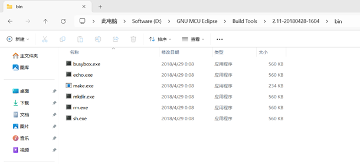

## 简介
小胖达MCU是一种**基于RISC-V**、**完全开源**、**设计严谨**、**结构清晰**的处理器核，适用于交互、控制等任务，它具有以下特性：  

 - RV32 I[M]
 - 三级流水线（取指 -> 译码 -> 派遣+执行+写回）
 - 采用简单的静态分支预测（BTFN）
 - 支持单周期指令的数据旁路
 - 支持长指令（乘除法、加载/存储）乱序写回，支持后序单周期指令比前序长指令先写回
 - 采用ICB总线
 - 可运行C程序
 - 支持中断/异常，可处理多达63个外部中断
 - 在最小处理器系统中配备ITCM、DTCM、PLIC和CLINT
 - 支持JTAG在线调试, 支持UART编程烧录
 - 易于移植到FPGA

小胖达MCU尚未支持以下特性：  

 - ICache和DCache

## 文件结构
**doc**: 设计文档、参考手册  
**fpga**: 测评SOC源码、Vivado工程  
**rtl**: 处理器核的RTL代码  
**scripts**: 用于编译、UART编程烧录的脚本  
**software**: 外设驱动、软件程序示例  
**tb**: 测试平台  
**tools**: GNU工具链  

## 配置编译环境
1.下载MAKE工具和GNU工具链（[百度云链接](https://pan.baidu.com/s/1Wq-isumnnuQNxXdvCApr0g?pwd=1234)）  
2.安装MAKE工具  
将GNU MCU Eclipse.zip解压到任意文件夹下，在GNU MCU Eclipse/Build Tools/2.11-20180428-1604/bin下找到make.exe，并添加系统环境变量。  
比如，我们直接解压到D盘，那么在D:/GNU MCU Eclipse/Build Tools/2.11-20180428-1604/bin可以找到make.exe。  
  
然后，添加系统环境变量。  
  
3.安装GNU工具链  
将gnu-mcu-eclipse-riscv-none-gcc-8.2.0-2.2-20190521-0004-win64.zip解压到**600_panda_risc_v/tools**下。  
4.安装Python  
安装好Python并将python.exe所在目录添加到环境变量里。  
然后，为当前python环境安装pyserial库，打开命令行终端并执行：  
`` pip install pyserial ``  
> 作者在测试时使用的是python3.12。  

## 编译C程序
在**600_panda_risc_v/scripts**下，打开命令行终端，输入：  
`` python .\compile.py --target flow_led ``  
等待出现"请按任意键继续. . ."后，键入`` ENTER ``，并退出终端。  
> 生成的flow_led.txt是十六进制的机器码文本文件，flow_led.bin是二进制的机器码文件，flow_led.dump是汇编指令文件。  
其中，flow_led对应**600_panda_risc_v/software/test**下的软件项目**flow_led**。  

## 创建软件项目
1.先在**600_panda_risc_v/scripts**下，打开命令行终端，输入：  
`` python .\gen_makefile.py --target your_prj_name ``  
2.然后在**600_panda_risc_v/software/test**下新建文件夹**your_prj_name**，把刚才创建的Makefile复制进去。  
3.在**600_panda_risc_v/software/test/your_prj_name**下编写若干.c和.h。  
> 软件项目引用了**600_panda_risc_v/software/lib**下的驱动或工具程序，其使用的外设都能在Opensoc仓库里找到。  

## 搭建硬件工程
测评SOC的所有源码都在**600_panda_risc_v/fpga/panda_soc_eva**下，  
请修改**imem_init_file**参数为**boot_rom.txt**所在的路径（在**600_panda_risc_v/fpga**下），注意修改PLL的例化。  
在SOC测评工程中，PLL输出时钟的频率是**50MHz**。  

#### <center>存储映射表</center>
|内容|地址范围|区间长度|
|---|---|---|
|指令存储器|0x0000_0000 ~ ?|imem_depth|
|数据存储器|0x1000_0000 ~ ?|dmem_depth|
|APB-GPIO|0x4000_0000 ~ 0x4000_0FFF|4KB|
|APB-I2C|0x4000_1000 ~ 0x4000_1FFF|4KB|
|APB-TIMER|0x4000_2000 ~ 0x4000_2FFF|4KB|
|PLIC|0xF000_0000 ~ 0xF03F_FFFF|4MB|
|CLINT|0xF400_0000 ~ 0xF7FF_FFFF|64MB|
|调试模块|0xFFFF_F800 ~ 0xFFFF_FBFF|1KB|

#### <center>I/O表</center>
|I/O|说明|
|---|---|
|osc_clk|外部晶振时钟输入|
|ext_resetn|外部复位输入, 低有效|
|tck|JTAG时钟输入, 不用时上拉到高电平|
|trst_n|JTAG复位输入, 不用时上拉到高电平|
|tms|JTAG模式输入, 不用时上拉到高电平|
|tdi|JTAG数据输入, 不用时上拉到高电平|
|tdo|JTAG数据输出|
|boot|编程模式, 拨码开关, 1'b0 -> UART编程, 1'b1 -> 正常运行|
|gpio0[7:0]|LED|
|gpio0[9:8]|拨码开关|
|gpio0[13:10]|数码管位码|
|gpio0[21:14]|数码管段码|
|i2c0_scl|OLED显示屏SCL|
|i2c0_sda|OLED显示屏SDA|
|uart0_tx|串口发送端|
|uart0_rx|串口接收端|

#### <center>外部中断表</center>
|中断号|说明|
|---|---|
|0|不可用|
|1|GPIO0中断|
|2|TIMER0中断|
|3|UART0中断|

指令存储器的低2KB用作bootrom。  
小胖达risc-v最小系统（见panda_risc_v_min_proc_sys.v）接入了63位的外部中断向量（ext_itr_req_vec[62:0]），  
ext_itr_req_vec[0]对应中断号1，ext_itr_req_vec[1]对应中断号2，以此类推。  

> 在**600_panda_risc_v/fpga/vivado_prj**下提供了基于ZYNQ7020的示例Vivado工程。

## 下载与调试
可通过JTAG或UART来进行编程烧录。  

#### UART编程烧录
将boot引脚对应的拨码开关拨到**低电平**，此时CPU运行bootrom程序。  
将编译产生的.bin文件复制到**600_panda_risc_v/scripts**下，然后在scripts文件夹打开命令行终端，输入：  
`` python .\uart_prog.py ``  
然后，按提示打开串口（必须要输入打开的串口名才能打开，如"COM10"），输入.bin文件的路径，等待烧录完成。  
  
最后，将boot引脚对应的拨码开关拨到**高电平**，复位CPU，即可见CPU运行烧录的程序。  
> 如果提示无法接收到编程应答，那么可以在打开串口后（输入了要连接的串口后），按一下外部复位引脚。  

#### JTAG下载调试
连接好DapLink。  
在**600_panda_risc_v/tools/openocd**下打开命令行终端，输入：  
`` .\openocd.exe -f panda_risc_v.cfg ``  
然后，在同一目录再打开另外1个命令行终端，输入：  
`` telnet localhost 4444 ``  
接着，如果该目录下有bin文件，可以在**telnet**命令行终端输入以下命令来下载程序：  
`` load_image tube_scan.bin 0x00000800 ``  
最后，让处理器从0x00000800地址继续运行，在**telnet**命令行终端输入：  
`` resume 0x00000800 ``  
下面列举一些常用命令用于在线调试：  
```
暂停处理器：halt
处理器继续运行：resume [地址]
设置1个32位断点：bp [地址] 4
清除1个32位断点：rbp [地址]
单步执行：step
查看寄存器：reg [通用寄存器号/CSR名]
读取内存：mdw [地址] [32位数据的个数]
写入内存：mww [地址] [32位数据]
```
